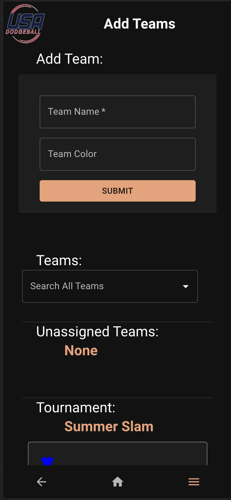
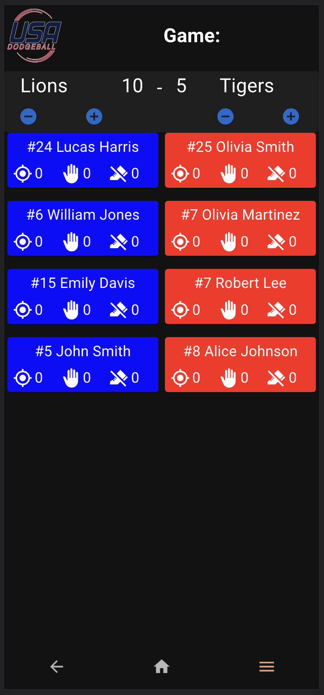

# Dodgeball-Stat-Tracker

## Introduction
*Duration: 2 Week Sprint*

Welcome to our dodgeball stat tracker, progressive web application.  This application is the brain-child of Will Buck. An avid, and passionate Dodgeballer. As well as an accomplished software engineer, as well. The application’s goal is to allow dodgeball players, officials, and attendees of tournaments, to track player/game statistics. Dodgeball is a fast paced game, and often in locations that may not have the best network connection. This app aims to address this, by providing a quick and intuitive user interface. Designed with tournament organizers in mind, this app simplifies the management of tournaments, teams, and players. As a progressive web app, it can be used offline, overcoming the challenge of unreliable cell service in dodgeball venues. 

## Usage
#### (User Only Side)
**Home Page**
- Has a list of all the upcoming tournaments
    - Has the ability to search for past tournament
- Down below has a nav bar
    - Back button to get to the previous page
    - Home button to go home
    - Side bar? For admin has all the admin features
- By clicking on the details or the whole card, takes you to the Game List page

**Game List Page**
- Has a list of  all the games in  the tournament
    - Also their scores 
    - Also the 2 teams playing against each other
- The top of the Page has a button for the leaderboard
    - That takes you to the leaderboard page

**Leaderboard Page** 
- Has a list of all the players in the tournament
    - Also their stats (kills, outs, and catches)
    - Their team name and their first and last name
    - Also its ranked by highest stats
- Clicking back on the nav bar below takes you to the game list page

**Game List Page**
- Clicking on the individual game goes to the stat tracker page

**Stat Tracker Page**
- The Top banner keeps score of the game
    - Can update the score when a team eliminates the other side.
- The team is split on the page
    - The Name of the players and #Number on their Jersey display on the page
    - With an individual stat tracker and counter
        - The target icon tracks kills
        - The hand icon tracks catches
        - The foot icon  tracks when a person steps out of bounds
    - The color of the individual cards corresponded with the team's color
- Clicking on The USA  Dodgeball logo takes you home

#### (Admin Only Side)
**Create Tournament Page**
- Can use the form input to create a tournament
    - Form input:
        - Name: Tournament Name
        - Date: Tournament Date
        - Location: Tournament Location
        - Court: All the courts available in the tournament
        - Description: Tournament Description 
    - Clicking  on Submit button, will get a  pop up
        - Pop up  will say successfully created a tournament
        - Also clear the input field 

**Manage Tournament Page** 
- Has a list of all tournament
- Edit button
    - Can delete delete a tournament 
    - Edit details button
        - Pop up to edit form Input: 
            - Name: Tournament Name
            - Date: Tournament Date
            - Location: Tournament Location
            - Court: All the courts available in the tournament
            - Description: Tournament Description 
        - Submit button
            - Saves the edited information
            - Also close the pop up

**Add Team/ Manage Teams**
- Can add a team with team name and color
    - Submit button, adds the team
- Can search for a team
    - Unassigned teams:
        - Are  teams without a tournament
- Tournament: 
    - All list of all tournaments
        - Their name
        - Also, all teams involved in that tournament
    - Edit button 
        - Can delete team
        - Add to tournament
            - Pop up of all tournaments 
            - Click on the tournaments to assign a team to a tournament

**Manage Users** 
- Can search all users 
- Team Captains
    - Has a list of all team captains
- Tournament Admin
    - Has a list of all tournament Admin
- Site Admin 
    - Has a list of all site Admin 
- Click on Edit privileges 
    - Can make  a user team captain, tournament Admin, or site Admin

## Screenshots

## Scope Document
Document [here][https://docs.google.com/document/d/1JGShjeD8cyOBLEfNXD_bK4BGUrSsnE_2Y5ZJUUYNcm4/edit#heading=h.lhguc6hte2r4].

## Installation
- Create a database named “usa_dodgeball”
- The queries in our “database.sql” file hold everything necessary for the project to run correctly. Ours was done in PostgresSQL.
- Open up VScode and run: npm install
- Run: npm run server
- Run: npm run client

## Built With
	Javascript   |   Node.js   |   React.js   |   Redux.js   |   PWA   |   Challonge API

## License
MIT

## Acknowledgements

Will Buck
Prime Digital Academy
Key Clark
Gavin Haseltine
Asiya Mohamed
Noel Schneider
Samuel Nelson
Ben Lynch

